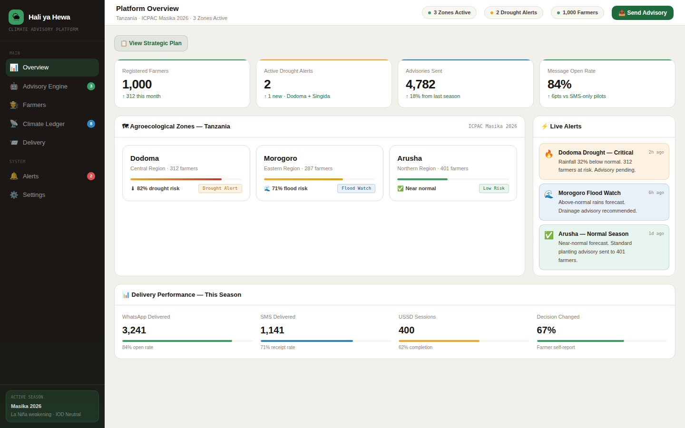

# Climate AI

**A climate advisory dashboard connecting farmers to advisory guidance and tracking climate-related data through a "Climate Ledger."**


## What this is

Climate AI is a dashboard-style web app with an advisory engine for sending guidance to farmers, a farmers-management view, a "Climate Ledger" for tracking climate-related records, and a strategic-plan view. This is the smallest and earliest-stage of CREOVA's prototype apps.



## Status: In active development (early stage)

This is an early prototype — a handful of core screens exist, but there's no backend, no defined data model for the "Climate Ledger," and no verified data sources behind the advisory engine yet.

### Roadmap
- Define what data the Climate Ledger actually tracks and where it comes from
- Backend/data layer
- Clarify target user (farmers directly, vs. an advisory intermediary)

## Quickstart

```bash
npm i
npm run dev
```

## Folder overview

- `src/app/components/dashboard/` — Sidebar, Topbar, and page views (Advisory Engine, Climate Ledger, Farmers, Overview)

## Contributing

See the [org-wide CONTRIBUTING.md](https://github.com/creova-gif/.github/blob/main/CONTRIBUTING.md) for guidelines, including our AI-assisted contribution policy.

## License

Proprietary — © CREOVA. All rights reserved.
