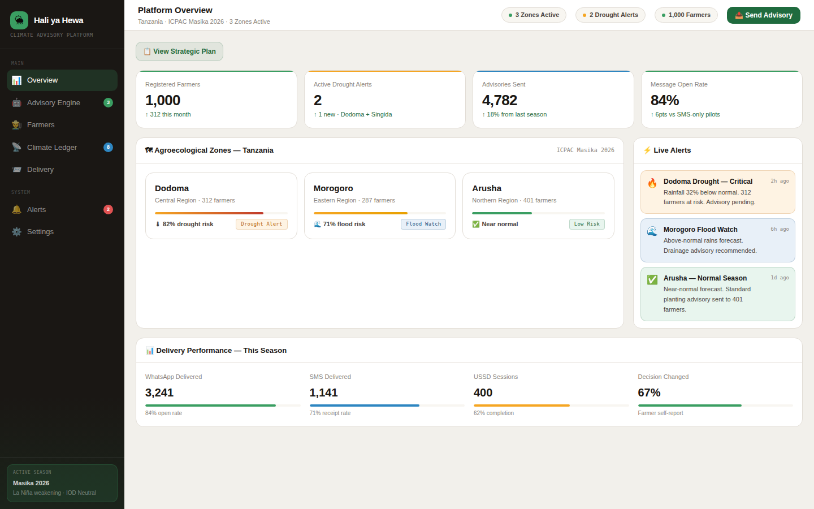

# Climate AI

**A climate advisory dashboard connecting farmers to advisory guidance and tracking climate-related data through a "Climate Ledger."**




## Overview
A dashboard-style web app for sending climate advisory guidance to farmers and tracking climate-related records.

## Problem
Farmers lack structured, trackable climate advisory guidance tailored to their region and situation.

## Solution
An advisory engine, farmer management view, and a "Climate Ledger" for climate-related record tracking — currently the smallest and earliest-stage app in the portfolio.

## Key Capabilities
- Advisory engine, farmers management, Climate Ledger, strategic-plan view

## Architecture
React/Vite. No backend, no defined data model for the Climate Ledger, no verified data sources behind the advisory engine yet — this is an early prototype, not a functional data product.

## Repository Structure
`src/app/components/dashboard/` — Sidebar, Topbar, page views (Advisory Engine, Climate Ledger, Farmers, Overview)

## Getting Started
```bash
npm i
npm run dev
```

## Project Status
Early prototype. Core screens exist; no real backend or data model yet.

## Roadmap
- [ ] Define what data the Climate Ledger actually tracks and where it comes from
- [ ] Backend/data layer
- [ ] Clarify target user (farmers directly, vs. an advisory intermediary)

## Contributing
See the [org-wide CONTRIBUTING.md](https://github.com/creova-gif/.github/blob/main/CONTRIBUTING.md).

## License
Proprietary — © CREOVA. All rights reserved.

## Author / Organization
Built by [Justin Mafie](https://github.com/creova-gif) under CREOVA.
